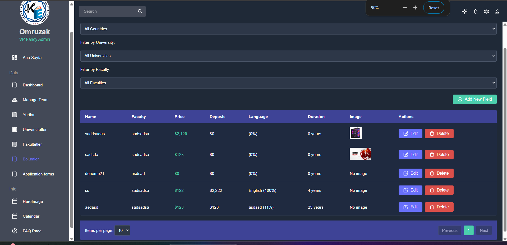
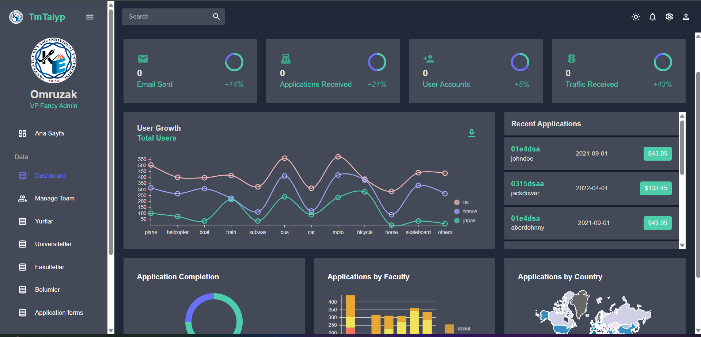

# TMTALYP University Portal


<!-- Add a project banner image showing your homepage -->

## 📚 Overview

TMTALYP University Portal is a comprehensive web application designed to connect international students with universities globally. The platform facilitates exploration of universities across different countries, provides detailed information about educational programs, and streamlines the university application process.

This portal serves as a centralized hub for international education opportunities, making it easier for students to discover educational institutions aligned with their academic and career goals. The system also provides administrators with powerful tools to manage university listings, country information, and featured content.

## ✨ Features

- **User Authentication**: Secure login/registration system with role-based access (User/Admin)
  - JWT-based authentication with token expiration
  - Encrypted password storage with BCrypt
  - Role-based access control for protected resources
  - First-time admin setup endpoint for initial system configuration
  - User profile management with personal information

- **University Exploration**: Browse universities filtered by country
  - Detailed university profiles with descriptions and pricing
  - Search functionality with text-based queries
  - University filtering by country of location
  - Pricing information including yearly fees and discount options

- **Dynamic Content Management**: Admin panel for managing universities, countries, and featured "heroes"
  - CRUD operations for all entities (universities, countries, heroes)
  - Image upload and management for visual content
  - Activation/deactivation of carousel heroes
  - Ordering control for hero display sequence

- **Responsive Design**: Mobile-friendly interface accessible across devices
  - Tailwind CSS-based responsive layouts
  - Optimized for desktop, tablet, and mobile experiences
  - Intuitive navigation with consistent UI patterns

- **Secure API**: JWT-based authentication with proper role authorization
  - Protected endpoints with method-level security
  - CORS configuration for security
  - Path-based security rules
  - Public/private endpoint differentiation

- **Image Storage**: Cloud-based image storage using Cloudflare R2
  - S3-compatible API integration
  - UUID-based unique file naming
  - Proper content-type handling
  - Public URL generation for frontend access

## 🖥️ Screenshots

### Homepage with Hero Section

<!-- Add a screenshot of your homepage with hero carousel -->

### University Listings

<!-- Add a screenshot of your universities grid/listing page -->

### Admin Dashboard

<!-- Add a screenshot of your admin dashboard -->

## 🛠️ Technology Stack

### Backend
- **Java 17**: Modern language features including records, enhanced switch expressions
- **Spring Boot 3.x**: Simplified application development with auto-configuration
- **Spring Security**: Comprehensive security framework with authentication and authorization
- **Spring Data MongoDB**: Simplified data access layer with automatic repository implementations
- **JWT Authentication**: Stateless authentication using JSON Web Tokens
- **MongoDB**: NoSQL database for flexible document storage
- **AWS SDK for Java**: Integration with S3-compatible storage (Cloudflare R2)
- **Java Bean Validation**: Data validation using annotations
- **SLF4J/Logback**: Comprehensive logging system
- **Spring Web MVC**: RESTful API development

### Frontend
- **React 18**: Component-based UI library with hooks and functional components
- **Vite**: Fast, modern frontend build tool and development server
- **Tailwind CSS**: Utility-first CSS framework for responsive design
- **Axios**: Promise-based HTTP client for API requests
- **React Router 6**: Client-side routing management
- **React Hook Form**: Form state management and validation
- **Context API**: State management for authentication and global state
- **React Error Boundary**: Graceful error handling
- **Responsive Design**: Mobile-first approach with flexible layouts

### Storage
- **Cloudflare R2**: S3-compatible object storage for images and assets
- **Content Delivery Network**: Global distribution for fast asset delivery
- **Image Optimization**: Proper content types and image compression

### Deployment
- **Cloudflare Workers**: Serverless runtime for frontend hosting
- **CI/CD Pipeline**: Automated build and deployment process
- **Environment Variables**: Configuration management across environments
- **Self-hosted or Cloud Hosting**: Flexible backend deployment options

## 🏗️ Architecture

The application follows a modern client-server architecture with clean separation of concerns:

```
┌─────────────┐      ┌──────────────┐      ┌───────────────┐
│             │      │              │      │               │
│   React     │◄────►│   Spring     │◄────►│   MongoDB     │
│  Frontend   │      │   Backend    │      │   Database    │
│             │      │              │      │               │
└─────────────┘      └──────────────┘      └───────────────┘
                            │
                            ▼
                     ┌──────────────┐
                     │              │
                     │ Cloudflare R2│
                     │  Storage     │
                     │              │
                     └──────────────┘
```

### Backend Architecture

The backend follows a layered architecture:

```
┌─────────────────────────────────────────────────────┐
│                   API Layer                          │
│  (Controllers: AuthController, UniversityController) │
└───────────────────────┬─────────────────────────────┘
                        │
┌───────────────────────▼─────────────────────────────┐
│                 Service Layer                        │
│  (Services: UserService, UniversityService)          │
└───────────────────────┬─────────────────────────────┘
                        │
┌───────────────────────▼─────────────────────────────┐
│                Repository Layer                      │
│  (Repositories: UserRepository, UniversityRepository)│
└───────────────────────┬─────────────────────────────┘
                        │
┌───────────────────────▼─────────────────────────────┐
│                  Data Layer                          │
│  (Models: User, University, Country, Hero)           │
└─────────────────────────────────────────────────────┘
```

### Cross-Cutting Concerns

Several components handle cross-cutting concerns:

1. **Security**: JwtAuthenticationFilter, SecurityConfig, JwtUtil
2. **Storage**: StorageService, AwsConfig
3. **Error Handling**: Global exception handlers
4. **Configuration**: WebConfig, CORS settings

### Frontend Architecture

The React frontend follows a component-based architecture:

1. **Pages**: Container components for each route (Home, Universities, Admin)
2. **Components**: Reusable UI elements (Header, Footer, Cards)
3. **Contexts**: Global state management (AuthContext)
4. **Services**: API communication with the backend
5. **Hooks**: Custom hooks for reusable logic
6. **Utils**: Helper functions and utilities

## 🚀 Getting Started

### Prerequisites
- Java 17+
- Node.js 16+
- MongoDB 6.0+
- Cloudflare R2 account (or alternative S3-compatible storage)
- Maven or Gradle (for backend build)
- Git

### Backend Setup

1. Clone the repository:
   ```bash
   git clone https://github.com/your-username/tmtalyp-university-portal.git
   cd tmtalyp-university-portal/backend
   ```

2. Configure your environment variables:
   Create an `application.properties` file with the following settings:
   ```properties
   # Server configuration
   server.port=8080
   
   # MongoDB configuration
   spring.data.mongodb.uri=mongodb://localhost:27017/tmtalyp
   spring.data.mongodb.auto-index-creation=true
   
   # JWT configuration
   jwt.secret=your-secret-key-here
   jwt.expiration=86400000
   
   # Cloudflare R2 configuration
   aws.accessKey=your-r2-access-key
   aws.secretKey=your-r2-secret-key
   aws.region=auto
   aws.bucketName=my-data
   aws.endpoint=https://your-account-id.r2.cloudflarestorage.com
   
   # Logging configuration
   logging.level.root=INFO
   logging.level.tmtalyp.backend=DEBUG
   logging.pattern.console=%d{yyyy-MM-dd HH:mm:ss} [%thread] %-5level %logger{36} - %msg%n
   
   # CORS configuration
   cors.allowed-origins=http://localhost:5173,https://frontend.yourdomain.com
   ```

3. Build and run the backend:
   ```bash
   # If using Maven
   ./mvnw spring-boot:run
   
   # If using Gradle
   ./gradlew bootRun
   ```
   
4. The backend will be available at `http://localhost:8080`

5. Verify the setup by accessing the debug endpoint:
   ```
   http://localhost:8080/debug/health
   ```

### Frontend Setup

1. Navigate to the frontend directory:
   ```bash
   cd ../frontend
   ```

2. Install dependencies:
   ```bash
   npm install
   ```

3. Configure the API base URL:
   Create a `.env.local` file with:
   ```
   VITE_API_BASE_URL=http://localhost:8080
   VITE_APP_TITLE=TMTALYP University Portal
   VITE_DEFAULT_LANGUAGE=en
   ```

4. Start the development server:
   ```bash
   npm run dev
   ```

5. The frontend will be available at `http://localhost:5173`

6. For production builds:
   ```bash
   npm run build
   ```
   The build output will be in the `dist` directory.

### Initial Admin Setup

1. Access the application in your browser
2. Register a regular user account first (if you prefer)
3. Use Postman or curl to send a POST request to `/auth/setup-admin` with admin credentials:
   
   ```json
   {
     "name": "Admin User",
     "email": "admin@example.com",
     "password": "securePassword123!",
     "surname": "Admin"
   }
   ```

4. You'll receive a JWT token in the response that can be used for authentication
5. Log in using the admin credentials to access the admin dashboard
6. This first-time admin setup endpoint is disabled after the first admin is created

### MongoDB Data Structure

The system uses the following MongoDB collections:

1. **users**: User accounts and authentication information
2. **countries**: Country listings with images and descriptions
3. **universities**: University profiles with detailed information
4. **heroes**: Hero carousel content for the homepage

### Testing the API

You can use tools like Postman or curl to test the API endpoints:

```bash
# Test the health endpoint
curl http://localhost:8080/debug/health

# Login as admin
curl -X POST http://localhost:8080/auth/login \
  -H "Content-Type: application/json" \
  -d '{"email":"admin@example.com","password":"securePassword123!"}'

# Create a new country (with admin JWT token)
curl -X POST http://localhost:8080/countries \
  -H "Content-Type: multipart/form-data" \
  -H "Authorization: Bearer YOUR_JWT_TOKEN" \
  -F "name=United States" \
  -F "description=Education opportunities in the USA" \
  -F "image=@/path/to/usa-flag.jpg"
```

## 📝 API Documentation

### Authentication Endpoints

| Method | URL | Description | Request Body | Response |
|--------|-----|-------------|--------------|----------|
| POST | `/auth/register` | Register a new user | `{"name":"John", "surname":"Doe", "email":"user@example.com", "password":"password123"}` | JWT token, user details |
| POST | `/auth/login` | Login a user | `{"email":"user@example.com", "password":"password123"}` | JWT token, user details, roles |
| POST | `/auth/setup-admin` | Create the first admin (one-time use) | `{"name":"Admin", "email":"admin@example.com", "password":"admin123"}` | JWT token, admin details |
| POST | `/auth/register-admin` | Register a new admin (admin only) | `{"name":"New Admin", "email":"newadmin@example.com", "password":"admin456"}` | JWT token, admin details |
| GET | `/auth/{id}` | Get user profile by ID | - | User details (without password) |
| PUT | `/auth/{id}` | Update user profile | `{"name":"Updated Name", "bio":"New bio content"}` | Updated user details |

### University Endpoints

| Method | URL | Description | Request Body/Params | Access |
|--------|-----|-------------|--------------|--------|
| GET | `/universities` | List all universities | - | Public |
| GET | `/universities/{id}` | Get university details | Path variable: university ID | Public |
| POST | `/universities` | Create a university | Multipart: `name`, `description`, `about`, `yearlyPrice`, `countryId`, `discountPrice` (optional), `image` (optional) | Admin |
| PUT | `/universities/{id}` | Update a university | Multipart: `name`, `description`, `about`, `yearlyPrice`, `countryId`, `discountPrice` (optional), `image` (optional) | Admin |
| DELETE | `/universities/{id}` | Delete a university | Path variable: university ID | Admin |
| GET | `/universities/by-country/{countryId}` | List universities by country | Path variable: country ID | Public |
| GET | `/universities/search?query=term` | Search universities | Query param: `query` (search term) | Public |

### Country Endpoints

| Method | URL | Description | Request Body/Params | Access |
|--------|-----|-------------|--------------|--------|
| GET | `/countries` | List all countries | - | Public |
| GET | `/countries/{id}` | Get country details | Path variable: country ID | Public |
| POST | `/countries` | Create a country | Multipart: `name`, `description`, `image` (optional) | Admin |
| PUT | `/countries/{id}` | Update a country | Multipart: `name`, `description`, `image` (optional) | Admin |
| DELETE | `/countries/{id}` | Delete a country | Path variable: country ID | Admin |
| GET | `/countries/{id}/universities` | List all universities in a country | Path variable: country ID | Public |
| GET | `/countries/search?query=term` | Search countries | Query param: `query` (search term) | Public |

### Hero Section Endpoints

| Method | URL | Description | Request Body/Params | Access |
|--------|-----|-------------|--------------|--------|
| GET | `/api/heroes` | List all heroes | - | Public |
| GET | `/api/heroes/active` | List active heroes | - | Public |
| GET | `/api/heroes/{id}` | Get hero details | Path variable: hero ID | Public |
| POST | `/api/heroes` | Create a hero | Multipart: `header`, `description`, `backgroundImage` (required), `iconImage` (optional), `order` (optional), `active` (optional) | Admin |
| PUT | `/api/heroes/{id}` | Update a hero | Multipart: `header`, `description`, `backgroundImage` (optional), `iconImage` (optional), `order` (optional), `active` (optional) | Admin |
| DELETE | `/api/heroes/{id}` | Delete a hero | Path variable: hero ID | Admin |

### Debug Endpoints

| Method | URL | Description | Access |
|--------|-----|-------------|--------|
| GET | `/debug/health` | Check application health | Public |
| GET | `/debug/endpoints` | List all registered endpoints | Public |
| GET | `/debug/hero-check` | Check hero controller configuration | Public |

### Response Formats

All API endpoints return responses in JSON format. Successful responses typically follow this structure:

```json
{
  "id": "60f7b9a84f215e3d28a4f581",
  "name": "Example University",
  "description": "A leading institution in education",
  "about": "Detailed information about the university...",
  "yearlyPrice": 10000.00,
  "discountPrice": 8500.00,
  "imageUrl": "https://pub-cab830fe342c4f9480be11e8b3347409.r2.dev/my-data/image-uuid.jpg",
  "imageFileName": "image-uuid.jpg",
  "countryId": "60f7b9914f215e3d28a4f580"
}
```

Error responses follow this structure:

```json
{
  "timestamp": "2025-05-06T12:34:56.789Z",
  "status": 400,
  "error": "Bad Request",
  "message": "Email already exists",
  "path": "/auth/register"
}
```

## 🔒 Security

The application implements comprehensive security measures:

### Authentication & Authorization
- **JWT-based Authentication**: JSON Web Tokens for stateless authentication
- **Token Expiration**: Configurable token expiration times
- **Password Encryption**: BCrypt password hashing with configurable work factor
- **Role-based Access Control**: Fine-grained permissions (USER/ADMIN roles)
- **Method-level Security**: `@PreAuthorize` annotations for controller methods
- **API Path Security**: URL pattern-based security rules

### Web Security
- **CORS Configuration**: Restrictive Cross-Origin Resource Sharing settings
- **CSRF Protection**: Cross-Site Request Forgery prevention
- **HTTP Headers**: Security headers configuration
- **Content Security Policy**: Controlled resource loading
- **XSS Protection**: Cross-site scripting prevention

### Data Security
- **Input Validation**: Request validation to prevent injection attacks
- **Secure Password Storage**: No plaintext passwords stored
- **Sensitive Data Handling**: Proper handling of personally identifiable information
- **Error Handling**: Generic error messages for security events

### Infrastructure Security
- **HTTPS**: Transport Layer Security for data in transit
- **Environment Isolation**: Separation of development and production environments
- **Logging**: Security event logging for auditing
- **Access Control**: S3/R2 bucket access permissions
- **Rate Limiting**: Prevention of brute force attacks

## 💾 Database Schema

### Users Collection
```json
{
  "_id": "ObjectId",
  "name": "String",
  "surname": "String",
  "email": "String (unique, indexed)",
  "password": "String (BCrypt hashed)",
  "dateOfBirth": "LocalDate (optional)",
  "phoneNumber": "String (optional)",
  "address": "String (optional)",
  "nationality": "String (optional)",
  "gender": "String (optional)",
  "profilePicture": "String (optional)",
  "bio": "String (optional)",
  "roles": ["String (USER, ADMIN)"],
  "createdDate": "LocalDateTime"
}
```

### Countries Collection
```json
{
  "_id": "ObjectId",
  "name": "String",
  "description": "String",
  "imageUrl": "String (optional)",
  "imageFileName": "String (optional)"
}
```

### Universities Collection
```json
{
  "_id": "ObjectId",
  "name": "String",
  "description": "String",
  "about": "String",
  "yearlyPrice": "Double",
  "discountPrice": "Double (optional)",
  "imageUrl": "String (optional)",
  "imageFileName": "String (optional)",
  "countryId": "String (reference to Countries)"
}
```

### Heroes Collection
```json
{
  "_id": "ObjectId",
  "header": "String",
  "description": "String",
  "backgroundImage": "String",
  "backgroundImageFileName": "String",
  "iconImage": "String (optional)",
  "iconImageFileName": "String (optional)",
  "order": "Integer",
  "active": "Boolean"
}
```

## 🔍 Common Issues and Solutions

### CORS Configuration
If you encounter CORS errors during development:
1. Ensure your allowed origins in `SecurityConfig.java` and `WebConfig.java` match your frontend URL
2. Remove any `@CrossOrigin` annotations with wildcards (`*`) when using `allowCredentials(true)`
3. Set proper exposed headers in the CORS configuration

### JWT Authentication
If experiencing authentication issues:
1. Check token expiration times in your properties
2. Verify that token is being sent in the `Authorization` header with the `Bearer` prefix
3. Examine server logs for token validation errors

### Image Loading
If images fail to load with SSL errors:
1. Ensure your Cloudflare R2 bucket has proper CORS and public access settings
2. Verify the correct URL format in the `StorageService` and `AwsConfig` classes
3. Add image error handling in your React components to provide fallbacks

### MongoDB Connection
If database connection fails:
1. Check your MongoDB connection string and credentials
2. Ensure MongoDB service is running and accessible from your application
3. Verify any network settings or firewall rules that might block the connection

## 📊 Project Structure

```
tmtalyp-university-portal/
├── backend/
│   ├── src/main/java/tmtalyp/backend/
│   │   ├── Auth/
│   │   │   ├── Jwt/
│   │   │   │   ├── JwtAuthenticationFilter.java
│   │   │   │   └── JwtUtil.java
│   │   │   └── user/
│   │   │       ├── AuthController.java
│   │   │       ├── LoginRequest.java
│   │   │       ├── User.java
│   │   │       ├── UserRepository.java
│   │   │       └── UserService.java
│   │   ├── Config/
│   │   │   ├── AwsConfig.java
│   │   │   └── WebConfig.java
│   │   ├── countries/
│   │   │   ├── Country.java
│   │   │   ├── CountryController.java
│   │   │   ├── CountryRepository.java
│   │   │   └── CountryService.java
│   │   ├── debug/
│   │   │   └── DebugController.java
│   │   ├── hero/
│   │   │   ├── Hero.java
│   │   │   ├── HeroController.java
│   │   │   ├── HeroRepository.java
│   │   │   └── HeroService.java
│   │   ├── universities/
│   │   │   ├── StorageService.java
│   │   │   ├── University.java
│   │   │   ├── UniversityController.java
│   │   │   ├── UniversityRepository.java
│   │   │   └── UniversityService.java
│   │   └── TmtalypApplication.java
│   ├── src/main/resources/
│   │   └── application.properties
│   ├── src/test/
│   │   └── java/
│   ├── pom.xml (or build.gradle)
│   └── README.md
├── frontend/
│   ├── public/
│   │   ├── assets/
│   │   └── index.html
│   ├── src/
│   │   ├── components/
│   │   │   ├── Header/
│   │   │   ├── Footer/
│   │   │   ├── Hero/
│   │   │   ├── Universities/
│   │   │   └── Admin/
│   │   ├── pages/
│   │   │   ├── Home/
│   │   │   ├── UniversitiesPage/
│   │   │   ├── UniversityDetail/
│   │   │   ├── CountriesPage/
│   │   │   ├── AdminDashboard/
│   │   │   └── Login/
│   │   ├── contexts/
│   │   │   └── AuthContext.jsx
│   │   ├── hooks/
│   │   ├── services/
│   │   │   ├── api.js
│   │   │   ├── authService.js
│   │   │   └── universityService.js
│   │   ├── utils/
│   │   ├── App.jsx
│   │   └── main.jsx
│   ├── package.json
│   ├── vite.config.js
│   └── README.md
├── docker/
│   ├── docker-compose.yml
│   ├── Dockerfile.backend
│   └── Dockerfile.frontend
├── .github/
│   └── workflows/
│       └── ci-cd.yml
├── LICENSE
└── README.md
```

## 🔄 CI/CD Pipeline

The project includes a continuous integration and deployment pipeline that automates the following steps:

1. **Build and Test Backend**:
   - Compile Java code
   - Run unit and integration tests
   - Generate test coverage reports

2. **Build and Test Frontend**:
   - Install Node.js dependencies
   - Run linting checks
   - Execute unit tests
   - Build production-ready assets

3. **Deployment**:
   - Package backend as a JAR file
   - Build frontend for production
   - Deploy backend to cloud/server
   - Deploy frontend to Cloudflare Workers

4. **Post-Deployment Verification**:
   - Health check endpoints verification
   - Smoke tests for critical functionality

## 🚀 Deployment

### Backend Deployment

The Spring Boot backend can be deployed to various environments:

1. **Docker Deployment**:
   ```bash
   # Build the Docker image
   docker build -t tmtalyp-backend -f docker/Dockerfile.backend .
   
   # Run the container
   docker run -p 8080:8080 tmtalyp-backend
   ```

2. **JAR Deployment**:
   ```bash
   # Build the JAR file
   ./mvnw clean package -DskipTests
   
   # Run the JAR file
   java -jar target/tmtalyp-backend-1.0.0.jar
   ```

3. **Cloud Provider Deployment**:
   - Deploy to AWS Elastic Beanstalk
   - Deploy to Google Cloud Run
   - Deploy to Azure App Service

### Frontend Deployment

The React frontend can be deployed to Cloudflare Workers or other static hosting services:

1. **Build for Production**:
   ```bash
   cd frontend
   npm run build
   ```

2. **Deploy to Cloudflare Workers**:
   ```bash
   # Install Wrangler CLI
   npm install -g wrangler
   
   # Configure Wrangler
   wrangler config
   
   # Deploy
   wrangler publish
   ```

3. **Alternative Static Hosting**:
   - Netlify
   - Vercel
   - GitHub Pages

## 🤝 Contributing

Contributions are welcome! Please feel free to submit a Pull Request.

1. Fork the repository
2. Create your feature branch (`git checkout -b feature/amazing-feature`)
3. Commit your changes (`git commit -m 'Add some amazing feature'`)
4. Push to the branch (`git push origin feature/amazing-feature`)
5. Open a Pull Request

### Code Style Guidelines

We follow these coding standards:
- **Java**: Google Java Style Guide
- **JavaScript/React**: Airbnb JavaScript Style Guide
- **Commits**: Conventional Commits specification

### Pull Request Process

1. Ensure your code passes all tests
2. Update documentation with details of changes
3. Add yourself to contributors list if not already there
4. Request review from at least one maintainer
5. Merge after approval

## 📄 License

This project is licensed under the MIT License - see the [LICENSE](LICENSE) file for details.

## 👥 Team

- [Azat Vepakulyyev ](https://github.com/Arious18) - Developer


## 🙏 Acknowledgements

- [Spring Boot](https://spring.io/projects/spring-boot) for the backend framework
- [React](https://reactjs.org/) for the frontend library
- [MongoDB](https://www.mongodb.com/) for the database
- [Cloudflare](https://www.cloudflare.com/) for R2 storage and Workers hosting
- [Tailwind CSS](https://tailwindcss.com/) for UI styling
- [JWT](https://jwt.io/) for authentication implementation
- [AWS SDK](https://aws.amazon.com/sdk-for-java/) for S3-compatible storage integration
- [Vite](https://vitejs.dev/) for frontend tooling
- [React Router](https://reactrouter.com/) for client-side routing

## 📞 Contact

For questions, support, or collaboration, reach out to:

- Blog Website: [My Blog](https://blog.azatvepakulyyev.workers.dev/)
- Email: azatvepakulyyev@gmail.com

---

<p align="center">
  Made with ❤️ by Azat Vepakulyyev  
</p>


---
